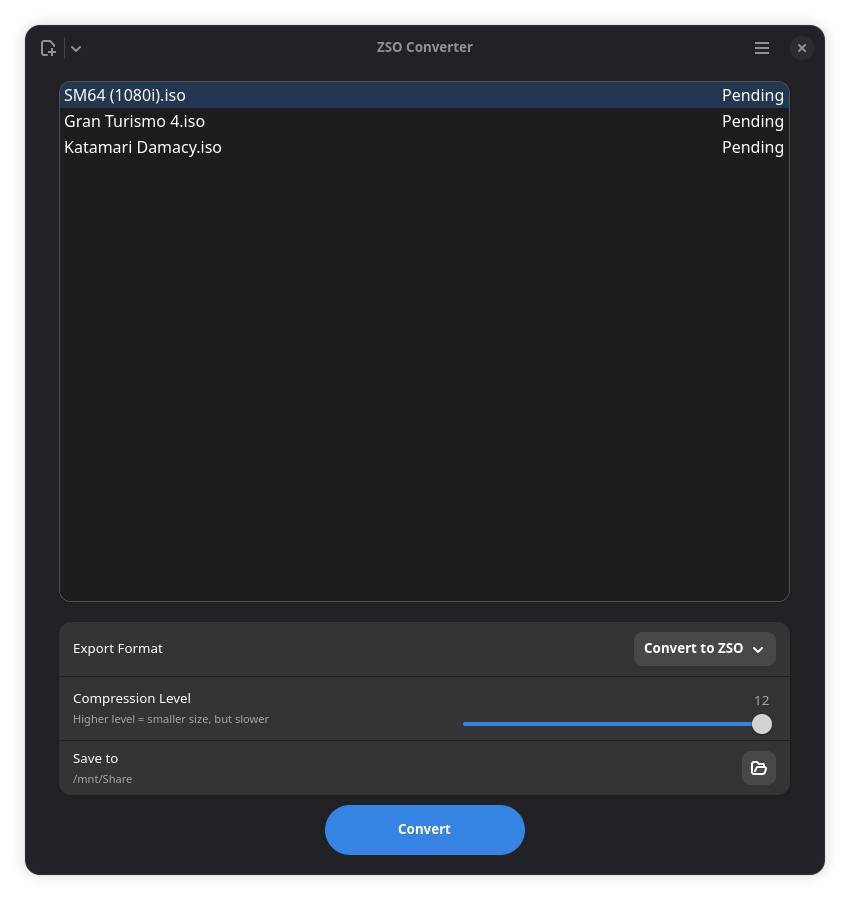

# ZSO Converter


A modern and lightweight application to compress and decompress PS2 games in **ZSO** (ZISO) format, built with **GTK 4** and **LibAdwaita**.


## ✨ Features

- **Native and Modern**: Visuals following GNOME standards (Adwaita).
- **Easy to Use**: Drag and drop files or entire folders.
- **Multiprocessing**: Accelerated compression using all processor cores.
- **Secure**: Sandboxed execution via Flatpak, using XDG Portals.




## 🚀 How to Use

### Prerequisites
- Linux with [Flatpak](https://flatpak.org/) support.
- `flatpak-builder` (to compile).

### Installation and Execution
```bash
# 1. Compile and install (User mode)
make

# 2. Run
make run

# 3. Generate .flatpak Bundle (for distribution)
make bundle

# 3. Clean build files
make clean
```

> **Note**: When running, select the destination folder for conversion. The app will automatically filter duplicate or invalid files.

## 🛠️ Technologies

- **Python 3**
- **GTK 4** + **LibAdwaita**
- **LZ4** (Compression)

## 📜 Credits

- [Original Core: **Virtuous Flame**](https://github.com/ps2homebrew/Open-PS2-Loader/blob/45875da788b82002625137cfadbd0d398b674667/pc/ziso.py)
- Development: **Gabriel**
